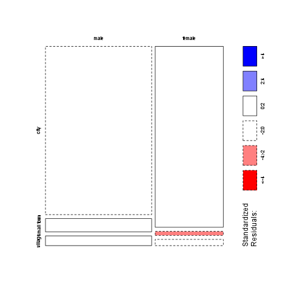

% Crosstable
% Rapport package team @ https://github.com/aL3xa/rapport
% 2011-04-26 20:25 CET

## Description

Returning the Chi-squared test of two given variables with count,
percentages and Pearson's residuals table.

### Variable description

Two variables specified: \* "gender" ("Gender") with 709 and \* "dwell"
("Dwelling") with 709 valid values.

### Counts

           **city**    **small town**   **village**
  -------- ----------- ---------------- -------------
  male     380.00000   30.00000         22.00000
  female   262.00000   6.00000          9.00000

### Percentages

           **city**   **small town**   **village**
  -------- ---------- ---------------- -------------
  male     0.53597    0.04231          0.03103
  female   0.36953    0.00846          0.01269

#### Row percentages

           **city**   **small town**   **village**
  -------- ---------- ---------------- -------------
  male     0.87963    0.06944          0.05093
  female   0.94585    0.02166          0.03249

#### Column percentages

           **city**   **small town**   **village**
  -------- ---------- ---------------- -------------
  male     0.59190    0.83333          0.70968
  female   0.40810    0.16667          0.29032

### Chi-squared test

              **X-squared**   **df**    **p-value**
  ----------- --------------- --------- -------------
  X-squared   9.71883         2.00000   0.00776

  --------------------------------------------------------------------------------------------------------------------------------------------------------------------------------------------------------
  It seems that a real association can be pointed out between *gender* and *dwell* by the *Pearson's Chi-squared test* (χ=9.7188 at the degree of freedom being 2) at the significance level of 0.00776.
  Based on Goodman and Kruskal's lambda it seems that *dwell* (λ=0.75812) has an effect on *gender* (λ=0) if we assume both variables to be nominal.
  The association between the two variables seems to be weak based on Cramer's V (0.08279).
  --------------------------------------------------------------------------------------------------------------------------------------------------------------------------------------------------------

#### Pearson's residuals

           **city**   **small town**   **village**
  -------- ---------- ---------------- -------------
  male     -2.94090   2.82766          1.17125
  female   2.94090    -2.82766         -1.17125

#### Mosaic chart

